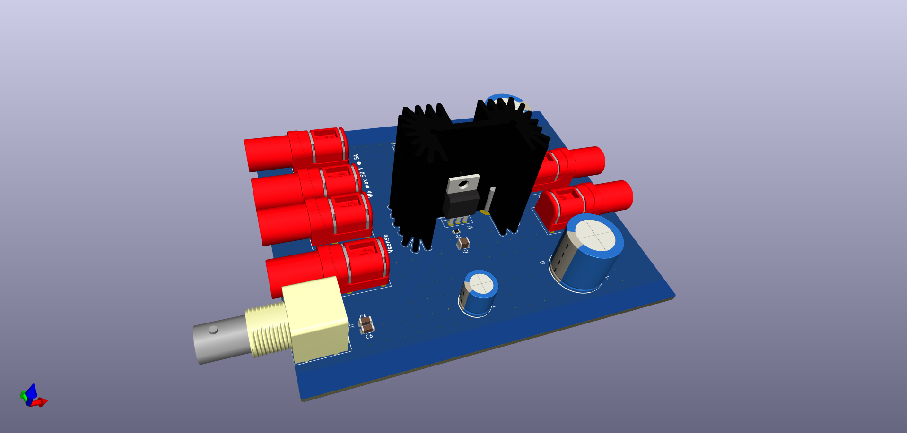
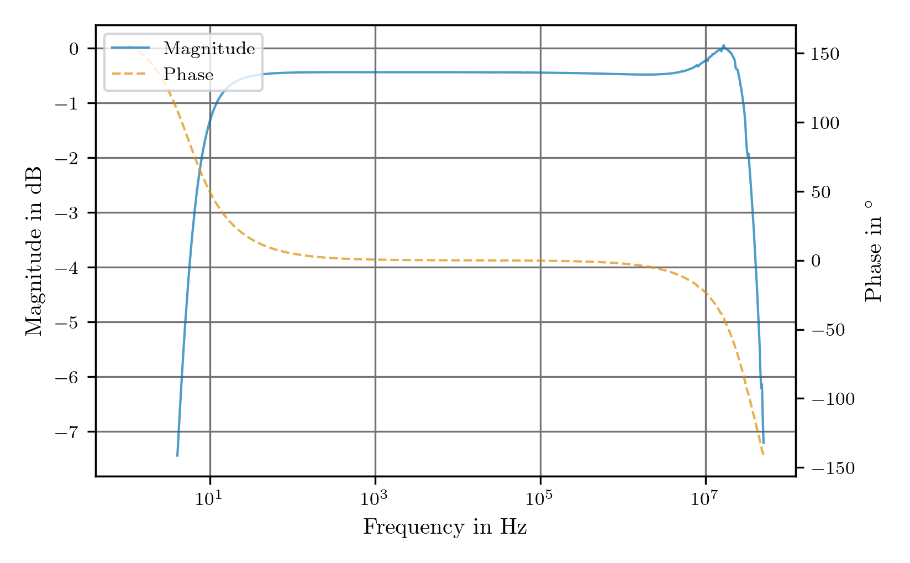
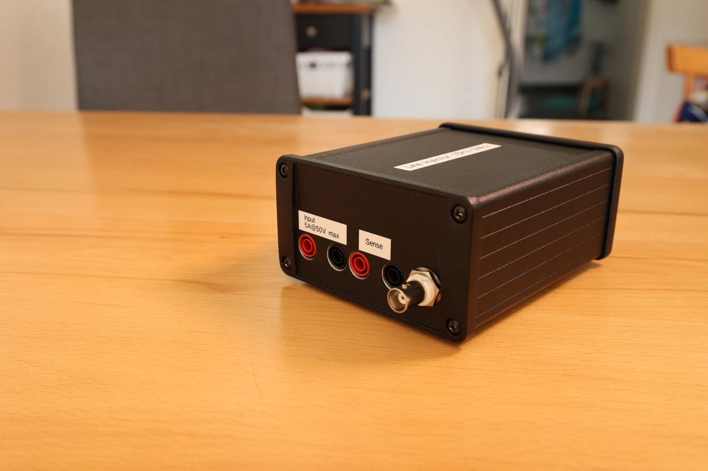
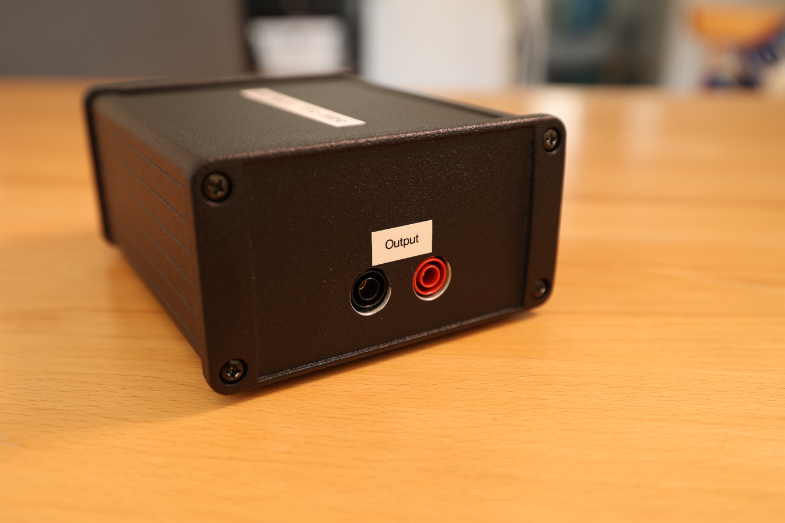
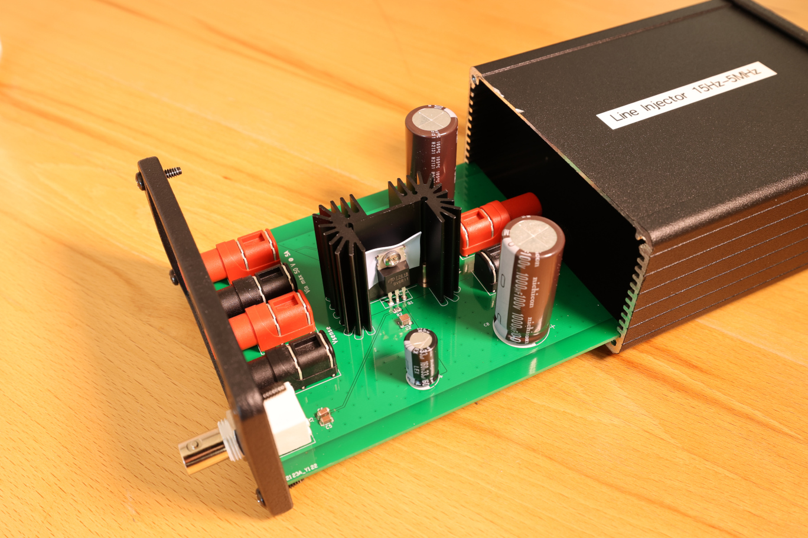

Line Injector
===================

This repository contains the schematics and mechanical files for a line injector. A line can be used to inject a ripple voltage into the supply line of a circuit. This can, for example, be used to measure the [power supply rejection ratio (PSRR)](https://en.wikipedia.org/wiki/Power_supply_rejection_ratio) of a regulator.

Key Features:
 * Bandwidth (-3 dB): 6 Hz - 35 MHz (into 50 Ω)
 * Passband transfer function is about 0.95 V/V (@ 5V) and 0.975 V/V (@ 15V)
 * Maximum input voltage: 50 V
 * Maximum current: 5 A
 * Remote sensing inputs to compensate for the voltage drop over the MOSFET

The design was done using [KiCAD 6](https://www.kicad.org/).

Bode Plot
------------------------------

Additionally, a report from the Bode 100 VNA used to characterize the injector can be found [here](/supplemental/Line%20Injector_JFW.pdf).

Photos of the finished design
------------------------------

### Front

### Back

### PCB

About
-----

The root folder contains the KiCAD files, while the gerber files can be found in the [/gerber](gerber/) folder, the bill of materials in the [/bom](bom/) folder.

Related Repositories
--------------------

See the following repositories for more information

KiCAD footprints: https://github.com/PatrickBaus/footprints.pretty

KiCAD 3D models: https://github.com/PatrickBaus/footprints.3dshapes

KiCAD schematic libraries: https://github.com/PatrickBaus/KiCad-libraries

License
-------

This work is released under the Cern OHL v.1.2
See www.ohwr.org/licenses/cern-ohl/v1.2 or the included LICENSE file for more information.
