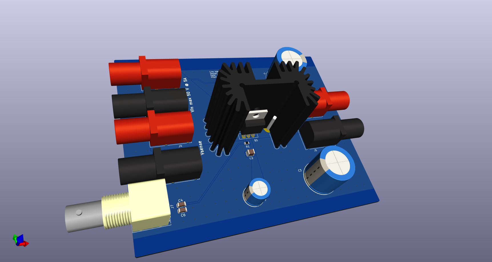

# Line Injector
This repository contains the schematics and mechanical files for a line injector.

## Contents
- [Introduction](#introduction)
- [Bode Plot](#bode-plot)
- [PCB Design Files](#pcb-design-files)
- [Mechanical Design Files](#mechanical-design-files)
- [Related Repositories](#related-repositories)
- [Versioning](#versioning)
- [License](#license)

## Introduction
A line injector can be used to inject a ripple voltage into the supply line of a circuit. This can, for example, be used to measure the [power supply rejection ratio (PSRR)](https://en.wikipedia.org/wiki/Power_supply_rejection_ratio) of a regulator.

Key Features:
 * Bandwidth (-3 dB): 6 Hz - 35 MHz (into 50 Ω)
 * Passband transfer function is about 0.95 V/V (@ 5V) and 0.975 V/V (@ 15V)
 * Maximum input voltage: 50 V
 * Maximum current: 5 A
 * Remote sensing inputs to compensate for the voltage drop over the MOSFET

The design was done using [KiCAD 8](https://www.kicad.org/).

## Bode Plot

Additionally, a report from the Bode 100 VNA used to characterize the injector can be found [here](/supplemental/Line%20Injector_JFW.pdf).

Photos of the finished design
------------------------------

### Front

### Back

### PCB

## PCB Design Files
The root folder contains the KiCAD files. The bill of materials can be found on the [releases](../../releases) page along with Gerber files for production.

## Mechanical Design Files
The PCB fits into a Hammond Manufacturing [1457N1201EBK](https://www.hammfg.com/electronics/small-case/extruded/1457-emi) case. Additionally a few drilled holes need to be drilled for the connectors.

## Related Repositories
See the following repositories for more information

KiCAD footprints: https://github.com/PatrickBaus/footprints.pretty

KiCAD 3D models: https://github.com/PatrickBaus/footprints.3dshapes

KiCAD schematic libraries: https://github.com/PatrickBaus/KiCad-libraries

## Versioning
I use [SemVer](http://semver.org/) for versioning. For the versions available, see the [tags](../../tags) available for this repository.

- MAJOR versions in this context mean a breaking change to the external interface of the hardware like different connectors or functions.
- MINOR versions contain changes to the hardware that only affect the inner workings of the circuit, but otherwise the performance is unaffected.
- PATCH versions do not affect the schematics or invalidate older bill of materials. These changes may include updated components (to replace obsolete parts for example), an updated silkscreen, or fixed typos.

## License
This work is released under the CERN-OHL-W
See [https://ohwr.org/cern_ohl_w_v2.pdf](https://ohwr.org/cern_ohl_w_v2.pdf) or the included LICENSE file for more information.
